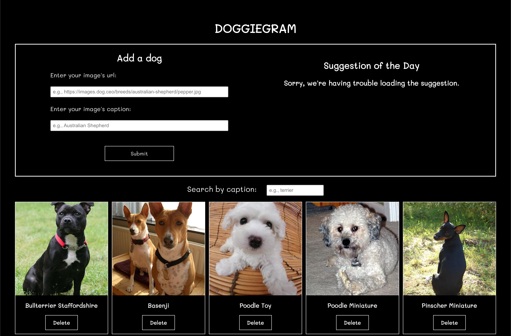

# Starter redux assessment: Doggiegram

This project was bootstrapped with [Create React App](https://github.com/facebook/create-react-app).

## Available scripts

In the project directory, you can run the following commands:

### `npm install`

Installs the project dependencies, including Redux packages such as @reduxjs/toolkit and react-redux.

### `npm run dev`

Runs the React app in the development mode.\
Open [http://localhost:3000](http://localhost:3000) to view it in your browser.

Runs an Express API at `http://localhost:3004` that exposes a single endpoint, `GET /api/suggestion`, which returns a dog suggestion at random.

The page will reload when you make changes.\
You may also see any lint errors in the console.

### `npm test`

Runs the test suites.

###

# Create React App Starter Code

## Existing Files

The starter code uses a typical Create React App folder structure. The component files have been set up for you. You can follow along with the lesson to complete the rest of the implementation.

### File Path

| File Path        | Description                                                                          |
| ---------------- | ------------------------------------------------------------------------------------ |
| src/app/store.js | Creates the Redux store, which is connected to several slice reducers.               |
| src/app/index.js | Contains the entry point to the React application.                                   |
| src/App.js       | Contains the App component which wraps the other components.                         |
| src/features     | Contains the application components for the photos, search, and suggestion features. |
| src/server       | Contains a server that the React app can use to get data through HTTP requests.      |

Go ahead and spend some time familiarizing yourself with the provided files.

## Add a New Photo

A user should be able to add a photo to their collection. In the Add a dog section, when a user enters an image URL and a caption for the photo, the photo should appear in the list of photos displayed below.

In the `src/features/photos/photos.slice.js` file, complete the following task:

- Task 1: Create an addPhoto() case reducer that adds a photo to the state.

In the `src/features/photos/create/index.js` file, complete the following tasks:

- Task 2: Import the useDispatch() method from the appropriate package.
- Task 3: Import the addPhoto() action creator from the photos slice.
- Task 4: Store a reference to the Redux store's dispatch method in a variable called dispatch.
- Task 5: Dispatch the addPhoto()action creator, passing in the form data.

## Remove a Photo

A user should be able to remove a photo from their collection. When a user clicks the Delete button on a photo, that photo should no longer be displayed on the page.

In the `src/features/photos/photos.slice.js` file, complete the following task:

- Task 6: Create a `removePhoto()` case reducer that removes a photo from `state.photos`.

In the `src/features/photos/list/index.js` file, complete the following tasks:

- Task 7: Import the `removePhoto()` action creator from the photos slice.
- Task 8: Store a reference to the Redux store's dispatch method in a variable called `dispatch`.
- Task 9: Dispatch the `removePhoto()` action creator, passing in the id.

## Search and Filter the Photos

A user should be able to search for a photo in their collection by providing a search term. For example, when the user enters "terrier" into the Search by caption box, then only photos whose captions match the term "terrier" should be displayed on the page. The matching should be case-insensitive, so "Terrier Tibetan" would be considered a match for the "terrier" search term.

First, spend some time studying the `src/features/search/search.slice.js` file. You don't have to edit anything in this file.

In the `src/features/search/search-bar/index.js` file, complete the following tasks:

- Task 10: Store a reference to the Redux store's dispatch method in a variable called `dispatch`.
- Task 11: Dispatch the `setSearchTerm()` action creator, passing in the value of the user's search input.

In the `src/features/photos/photos.slice.js` file, complete the following task:

- Task 12: Complete the `selectFilteredPhotos()` selector to return a filtered list of photos whose captions match the user's search term.

Finally, in the `src/features/photos/list/index.js` file, complete the following tasks:

- Task 13: Import the `selectFilteredPhotos()` selector from the photos slice.
- Task 14: Call `useSelector()` with `selectFilteredPhotos` instead of `selectAllPhotos`.

## Load a Photo Suggestion

In the Suggestion of the Day section, a user should be able to see a dog suggestion that can be added to their collection.

The user should see a loading state while the HTTP request for the suggestion is pending and an error state if the HTTP request for the suggestion fails.

In the `src/features/suggestion/suggestion.slice.js` file, complete the following tasks:

- Task 15: Complete the `createAsyncThunk()` function to load a suggestion from this URL: [http://localhost:3004/api/suggestion](http://localhost:3004/api/suggestion).

- Task 16: Inside `extraReducers`, add reducers to handle all three promise lifecycle states—pending, fulfilled, and rejected—for the `fetchSuggestion()` call.

- Task 17: Create a selector, called `selectSuggestion`, for the suggestion state variable and export it from the file.

In the `src/features/suggestion/index.js` file, complete the following tasks:

- Task 18: Import the `selectSuggestion()` selector from the suggestion slice.

- Task 19: Call `useSelector()` with the `selectSuggestion()` selector. The component needs to access the `imageUrl` and `caption` properties of the suggestion object.

- Task 20: Dispatch the `fetchSuggestion()` action creator.

- Task 21: Enable the two JSX lines needed to display the suggestion on the page.

## Final result

